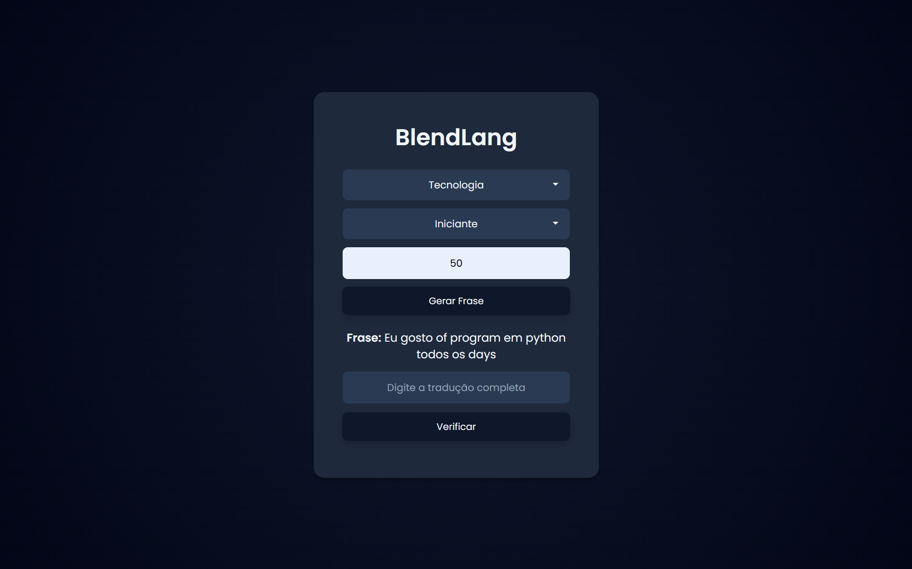

<h1 align="center">Projeto BlendLang 🌎</h1>

<h4 align="center"><a href="https://theodantas.github.io/quizes/">Confira o projeto aqui</a></h4>

---

## 📌 Sobre o Projeto

Aplicação web desenvolvida em **Python + Flask** que gera frases misturando português e inglês para auxiliar no aprendizado de idiomas.

## 🚀 Funcionalidades

- Sorteio de frases por categoria
- Níveis de dificuldade
- Mistura automática de idiomas
- Integração com Google Sheets como banco de dados
- Sistema de controle de uso das frases

## 🛠 Tecnologias utilizadas:

O BlendLang foi desenvolvido com foco em aprendizado de idiomas através da mistura de frases entre português e inglês. O projeto integra backend em Python com uma interface web simples e um banco de dados baseado em planilhas.

 
     
     
     
     
     
     
     

## 📚 Conceitos aplicados

Durante o desenvolvimento deste projeto foram aplicados diversos conceitos importantes de programação e desenvolvimento web:

✔️ Desenvolvimento de API backend com Flask;

✔️ Integração com Google Sheets como banco de dados utilizando API;

✔️ Manipulação e filtragem de dados para sorteio inteligente de frases;

✔️ Implementação de lógica de programação para controle de uso das frases;

✔️ Separação de responsabilidades no projeto (backend, lógica e interface);

✔️ Comunicação entre frontend (JavaScript) e backend (Flask) via requisições HTTP;

✔️ Estruturação e organização de projeto em módulos Python.

## 📂 Estrutura do Projeto

blendlang/
│
├── app.py
├── credenciais_google.json (não incluído no repositório)
├── requirements.txt
│
├── nucleo/
│ ├── carregar_frases.py
│ ├── conexao_planilha.py
│ ├── dicionario.py
│ └── mistura.py
│
├── templates/
│ └── index.html
│
└── static/
  └── style.css

---

<table align="center">
  <tr>
    <td>
      
    </td>
    <td>
      Feito por <a href="https://github.com/theodantas">Théo Dantas.</a> 🙋‍♂️
    </td>
  </tr>
</table>
